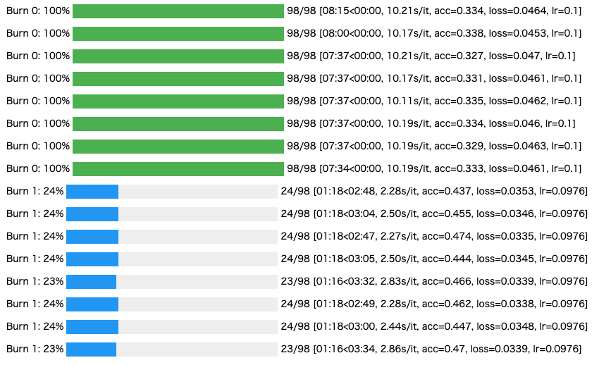
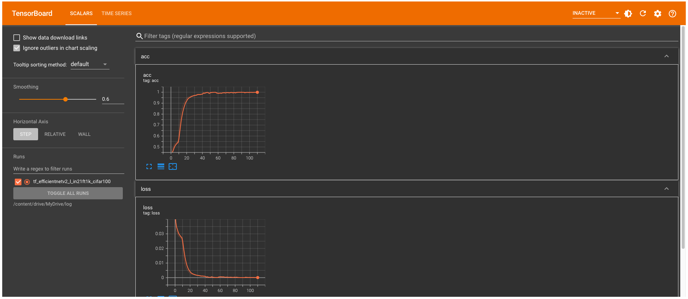
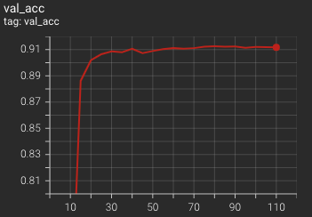

# PyTorch最新モデルでマルチコアTPUの本気を試す

[](https://colab.research.google.com/github/Soliton-Analytics-Team/Colab-Multicore-TPU/blob/main/ColabMulticoreTPU.ipynb)

## 1. はじめに

無料で使える[Google Colab](https://colab.reseach.google.com)はランタイムのタイプにTPUが選択できます。単に選択しただけで使えて欲しいところですが、あいにくそうはなっていません。また、ColabのTPUは8コア構成なのですが、1コアだけでも使えてしまうので、1コアだけで性能比較して、GPUとあんまり変わらないとしてしまっている記事をちらほら見かけます。実際、1コアだけだとP100と同程度の性能っぽいです。ただ、ColabのTPUのいいとろこは8コアを使えることと、TPUに付随するメモリがたくさん使えることなので、それを使いたい。

いろいろ探し回ったところ、素晴らしい記事を見つけました。「[転移学習でCIFAR-10正解率99%を達成する方法](https://qiita.com/T-STAR/items/de933c67b52a47f9efef)」です。ちゃんとTPUのマルチコアを使っている上に、きちんと最後まで正解率を煮詰めています。ただこの記事はKerasで実装しています。これをPyTorchにしたい。なぜかと言うと、[PyTorch Image Models](https://github.com/rwightman/pytorch-image-models)で公開されている事前学習済の最新モデルを試したいからです。

というわけで、基本的に上記の記事を踏襲しつつ、PyTorchでマルチコアのTPUを使ってみたので、ここに公開します。Colabのノートブックなので、全てのセルを実行すれば動作します。


まずはランタイムの設定がTPUになっているか確認します。なっていなければ、設定を変えてください。


```python
import os
assert os.environ['COLAB_TPU_ADDR'], 'Make sure to select TPU from Edit > Notebook settings > Hardware accelerator'
```

次にGoogleドライブをマウントします。Colabでは時間で実行停止されてしまうことがあるので、途中から再開できるように途中結果を保持するためです。


```python
from google.colab import drive
drive.mount('/content/drive')
```

    Mounted at /content/drive


[PyTorch/XLA](https://github.com/pytorch/xla)というライブラリをインストールします。下記の1.9という数字部分はアップデートされているかもしれません。適宜調整してください。依存関係のエラーが出る場合がありますが、現時点では影響ないので気にせず先に進んで問題ありません。


```shell
!pip install cloud-tpu-client==0.10 https://storage.googleapis.com/tpu-pytorch/wheels/torch_xla-1.9-cp37-cp37m-linux_x86_64.whl
```

    Collecting torch-xla==1.9
      Downloading https://storage.googleapis.com/tpu-pytorch/wheels/torch_xla-1.9-cp37-cp37m-linux_x86_64.whl (149.9 MB)
         |████████████████████████████████| 149.9 MB 20 kB/s 
    [?25hCollecting cloud-tpu-client==0.10
      Downloading cloud_tpu_client-0.10-py3-none-any.whl (7.4 kB)
      .
      .
      .


## 2. CIFAR100

それでは最初に画像分類の対象とするCIFAR100データセットを確認しましょう。これはtorchvisionの中にdatasetsとして内蔵されているので、簡単に取得できます。ちなみにdatasets.classesで分類の名前を取得できるのを今回はじめて知りました。


```python
import matplotlib.pyplot as plt
import torchvision

datasets = torchvision.datasets.CIFAR100(root='./data', download=True)

H = 10
W = 10
fig = plt.figure(figsize=(H, W))
fig.subplots_adjust(left=0, right=1, bottom=0, top=1.0, hspace=0.4, wspace=0.4)

for k in range(H * W):
    image = datasets.data[k]
    label = datasets.targets[k]
    plt.subplot(H, W, k+1)
    plt.imshow(image)
    plt.title(datasets.classes[label], fontsize=12)
    plt.axis('off')

plt.show()
```


画像は32x32で小さいですが、人間なら識別できますね。ただ本当に人間が分類するとなると100個の分類を覚えるのが大変です。何十万件も分類させられたらうっかり数％は間違えそうです。

## 3. モデル

検証に使うモデルは[PyTorch Image Models](https://github.com/rwightman/pytorch-image-models)のものを使います。以下で事前訓練済み重み付きのモデルの一覧を取得できます。


```shell
!pip install timm
import timm
timm.list_models(pretrained=False)
```

    Collecting timm
      Downloading timm-0.4.12-py3-none-any.whl (376 kB)
         |████████████████████████████████| 376 kB 5.3 MB/s 
    [?25hRequirement already satisfied: torchvision in /usr/local/lib/python3.7/dist-packages (from timm) (0.10.0+cu102)
    Requirement already satisfied: torch>=1.4 in /usr/local/lib/python3.7/dist-packages (from timm) (1.9.0+cu102)
    .
    .
    .
     'tf_efficientnetv2_l',
     'tf_efficientnetv2_l_in21ft1k',
     'tf_efficientnetv2_l_in21k',
     'tf_efficientnetv2_m',
     'tf_efficientnetv2_m_in21ft1k',
     'tf_efficientnetv2_m_in21k',
     'tf_efficientnetv2_s',
     .
     .
     .

'tf_efficientnetv2_l_in21ft1k'の文字が見えますね。これはImageNet-21Kで事前訓練された重みを持ったefficientnetv2と思われますので、今回はこれを使いましょう。


```python
model_name = 'tf_efficientnetv2_l_in21ft1k'
```

## 4. Transform

入力画像に対する前処理は、使用する事前学習済みモデルに合わせる必要があります。timmでは以下の様にするとその前処理を取得できます。


```python
from timm.data import resolve_data_config
from timm.data.transforms_factory import create_transform
import warnings
warnings.filterwarnings('ignore')

config = resolve_data_config({}, model=model_name)
print('config\n', config)
base_transform = create_transform(**config)
print('\nbase_transform\n', base_transform)
```

    config
     {'input_size': (3, 224, 224), 'interpolation': 'bicubic', 'mean': (0.485, 0.456, 0.406), 'std': (0.229, 0.224, 0.225), 'crop_pct': 0.875}
    
    base_transform
     Compose(
        Resize(size=256, interpolation=bicubic, max_size=None, antialias=None)
        CenterCrop(size=(224, 224))
        ToTensor()
        Normalize(mean=tensor([0.4850, 0.4560, 0.4060]), std=tensor([0.2290, 0.2240, 0.2250]))
    )


ということだったんですが、どうやら新しいモデルはデータが更新されていないようです。今回はこのまま進めますが、入力サイズを変更したい場合は下記のコメントを外して修正してください。


```python
# from torchvision import transforms
# from torchvision.transforms.functional import InterpolationMode
# input_size = (280, 280)
# crop_pct = 0.875

# base_transform = transforms.Compose([
#     transforms.Resize(size=int(input_size[0]/crop_pct),
#                       interpolation=InterpolationMode.BICUBIC),
#     transforms.CenterCrop(size=input_size),
#     transforms.ToTensor(),
#     transforms.Normalize(mean=[0.4850, 0.4560, 0.4060],
#                          std=[0.2290, 0.2240, 0.2250])
# ])
# print(base_transform)
```

件の記事では
> ここでは、よくある左右フリップと上下左右のShiftに加えて、Cutoutのサイズを0.4として２回と、Saturation/Contrastをランダムに変更する処理を入れた。

と書いてあるので概ね同様の処理になるようにしました。注意点として、torchvision.transformsのRandomErasing()は処理対象がテンソルなので、base_transformの後に挿入しなければなりません。

torchvision.transformsでどんなものが使えるのかは「[Pytorch – torchvision で使える Transform まとめ](https://pystyle.info/pytorch-list-of-transforms/)」が分かりやすいので参考にしてください。


```python
from torchvision import transforms
train_transform = transforms.Compose([transforms.RandomHorizontalFlip(),
                                        transforms.RandomCrop(32, padding=4),
                                        transforms.ColorJitter(brightness=0.2, contrast=0.2, saturation=0.5)]
                                       + base_transform.transforms
                                       + [transforms.RandomErasing(), transforms.RandomErasing()])
```

## 5. DataSet

焼き入れ用、学習用、評価用の３つのデータセットを作ります。


```python
from torchvision.datasets import CIFAR100

burn_dataset = CIFAR100(root='./data', train=True, transform=base_transform, download=True)
train_dataset = CIFAR100(root='./data', train=True, transform=train_transform, download=True)
test_dataset = CIFAR100(root='./data', train=False, transform=base_transform, download=True)

print(len(train_dataset), len(test_dataset))
```

    Files already downloaded and verified
    Files already downloaded and verified
    Files already downloaded and verified
    50000 10000


## 5.5. マルチコア動作の確認

せっかくなのでマルチコアで動作する様子を確認してみたいと思います。本当は記事の流れに沿って実際に訓練しながらプログレスバーを8本表示させたかったのですが、表示させると途中で処理が止まってしまうので断念しました。
この「5.5.　マルチコア動作の確認」内のコードは後の処理には必要ないので、確認する必要のない方は飛ばしてしまって構いません。

一気に全てのセルを実行するときに実行したくないので、コードは全てコメントアウトしておきます。
実行すると、下の画像のようにコア数と同数のプログレスバーが表示されます。



なお、本来実行するコードを確認用に切り詰めて編集したので、以下のコードは途中でエラーになって止まります。
プログレスバーで確認できたら、処理を中止して次の6.に進んでください。


```python
# import time
# import torch
# import torch_xla.core.xla_model as xm
# from tqdm.notebook import tqdm

# def train_fn(title, model, dataloader, optimizer, criterion, device):

#     running_loss = 0
#     total = 0
#     correct = 0

#     model.train()

#     dataloader = tqdm(dataloader)
#     dataloader.set_description(title)
#     for images, labels in dataloader:
#         images = images.to(device)
#         labels = labels.to(device)
#         optimizer.zero_grad()
#         lr = optimizer.param_groups[0]['lr']

#         outputs = model(images)
#         loss = criterion(outputs, labels)
#         loss.backward()
#         xm.optimizer_step(optimizer)

#         running_loss += loss.item()
#         _, predicted = torch.max(outputs.data, 1)
#         total += labels.size(0)
#         correct += (predicted == labels).float().sum().item()

#         dataloader.set_postfix(acc=correct/total, loss=running_loss/total, lr=lr)

#     return running_loss / total, correct / total
```


```shell
# !pip install 'git+https://github.com/katsura-jp/pytorch-cosine-annealing-with-warmup'
```


```python
# import os
# from torch import hub
# import torch_xla.distributed.parallel_loader as pl
# from cosine_annealing_warmup import CosineAnnealingWarmupRestarts
# import torch_xla.utils.serialization as xser
# from torch.utils.tensorboard import SummaryWriter

# def map_fn(index, flags):
#     EPOCHS = flags['num_epochs']
#     BATCH_SIZE = flags['batch_size']
#     BURN_STEPS = flags['burn_steps']
#     torch.manual_seed(flags['seed'])
            
#     train_sampler = torch.utils.data.distributed.DistributedSampler(
#           train_dataset,
#           num_replicas=xm.xrt_world_size(),
#           rank=xm.get_ordinal(),
#           shuffle=True)

#     log_writer = None
#     train_dataloader = torch.utils.data.DataLoader(train_dataset, batch_size=BATCH_SIZE, sampler=train_sampler, num_workers=flags['num_workers'])
#     burn_dataloader = torch.utils.data.DataLoader(burn_dataset, batch_size=BATCH_SIZE, sampler=train_sampler, num_workers=flags['num_workers'])
#     if xm.is_master_ordinal():
#         valid_dataloader = torch.utils.data.DataLoader(test_dataset, batch_size=BATCH_SIZE, num_workers=flags['num_workers'])

#     start_epoch = -1
#     if not xm.is_master_ordinal():
#         xm.rendezvous('download_only_once')
#     model = hub.load('rwightman/pytorch-image-models:master', model_name, pretrained=(start_epoch<0))
#     if start_epoch >= 0:
#         model.load_state_dict(state_dict['model'])
#     if xm.is_master_ordinal():
#         xm.rendezvous('download_only_once')
#     head = model.get_classifier()
#     head.out_features = 100

#     device = xm.xla_device()
#     model = model.to(device)
#     criterion = torch.nn.CrossEntropyLoss()

#     # Burn
#     if start_epoch < BURN_STEPS:
#         for param in model.parameters():
#             param.require_grad = False
#         for param in head.parameters():
#             param.require_grad = True
#         optimizer = torch.optim.SGD(head.parameters(), lr=flags['burn_lr'], momentum=0.9)
#         scheduler = CosineAnnealingWarmupRestarts(
#             optimizer,
#             first_cycle_steps=BURN_STEPS,
#             max_lr=flags['burn_lr'],
#             min_lr=flags['min_lr'],
#             warmup_steps=0)
#         for epoch in range(BURN_STEPS):
#             scheduler.step(epoch)
#             loss, acc = train_fn(f'Burn {epoch}',
#                                 model,
#                                 dataloader=pl.MpDeviceLoader(train_dataloader, device), 
#                                 optimizer=optimizer, 
#                                 criterion=criterion,
#                                 device=device)
#             if xm.is_master_ordinal():
#                 if log_writer:
#                     log_writer.add_scalar('loss', loss, epoch)
#                     log_writer.add_scalar('acc', acc, epoch)
#                     log_writer.flush()
#         if xm.is_master_ordinal():
#             loss, acc = valid_fn(f'Valid {BURN_STEPS}',
#                                 model,
#                                 dataloader=valid_dataloader, 
#                                 criterion=criterion, 
#                                 device=device)
#             if log_writer:
#                 log_writer.add_scalar('val_loss', loss, BURN_STEPS)
#                 log_writer.add_scalar('val_acc', acc, BURN_STEPS)
#                 log_writer.flush()
```


```python
# import torch_xla.distributed.xla_multiprocessing as xmp

# flags={}
# flags['batch_size'] = 64
# flags['num_workers'] = 8
# flags['burn_steps'] = 10
# flags['warmup_steps'] = 5
# flags['num_epochs'] = 1
# flags['burn_lr'] = 0.1
# flags['max_lr'] = 0.01
# flags['min_lr'] = 0.0005
# flags['seed'] = 1234
# xmp.spawn(map_fn, args=(flags,), nprocs=8, start_method='fork')
```

## 6. 学習と評価の関数

学習用と評価用の関数を定義します。通常のPyTorchのものとほぼ同じですが、学習用は分散処理するので、オプティマイザーのステップ実行がxm.optimizer_step(optimizer)になっています。ここで分散された各モデルの同期をとっています。


```python
import time
import torch
import torch_xla.core.xla_model as xm
from tqdm import tqdm

def train_fn(title, model, dataloader, optimizer, criterion, device):

    running_loss = 0
    total = 0
    correct = 0

    model.train()
    if xm.is_master_ordinal():
        dataloader = tqdm(dataloader)
        dataloader.set_description(title)
    for images, labels in dataloader:
        images = images.to(device)
        labels = labels.to(device)
        optimizer.zero_grad()
        lr = optimizer.param_groups[0]['lr']

        outputs = model(images)
        loss = criterion(outputs, labels)
        loss.backward()
        xm.optimizer_step(optimizer)

        running_loss += loss.item()
        _, predicted = torch.max(outputs.data, 1)
        total += labels.size(0)
        correct += (predicted == labels).float().sum().item()

        if xm.is_master_ordinal():
            dataloader.set_postfix(acc=correct/total, loss=running_loss/total, lr=lr)

    return running_loss / total, correct / total


def valid_fn(title, model, dataloader, criterion, device):

    running_loss = 0
    total = 0
    correct = 0

    model.eval()
    dataloader = tqdm(dataloader)
    dataloader.set_description(title)
    with torch.no_grad():
        for images, labels in dataloader:
            images = images.to(device)
            labels = labels.to(device)

            outputs = model(images)

            loss = criterion(outputs, labels)

            running_loss += loss.item()

            _, predicted = torch.max(outputs.data, 1)
            total += labels.size(0)
            correct += (predicted == labels).sum().item()
            dataloader.set_postfix(val_acc=correct/total, val_loss=running_loss/total)

    return running_loss / total, correct / total

```

    WARNING:root:Waiting for TPU to be start up with version pytorch-1.9...
    WARNING:root:Waiting for TPU to be start up with version pytorch-1.9...
    WARNING:root:TPU has started up successfully with version pytorch-1.9


## 7. 学習率スケジューラ

学習率スケジューラはウォームアップ付きコサインアニーリングを使いたいので、インストールします。


```shell
!pip install 'git+https://github.com/katsura-jp/pytorch-cosine-annealing-with-warmup'
```

    Collecting git+https://github.com/katsura-jp/pytorch-cosine-annealing-with-warmup
      Cloning https://github.com/katsura-jp/pytorch-cosine-annealing-with-warmup to /tmp/pip-req-build-6dvhbdr1
      Running command git clone -q https://github.com/katsura-jp/pytorch-cosine-annealing-with-warmup /tmp/pip-req-build-6dvhbdr1
    Building wheels for collected packages: cosine-annealing-warmup
      Building wheel for cosine-annealing-warmup (setup.py) ... [?25l[?25hdone
      Created wheel for cosine-annealing-warmup: filename=cosine_annealing_warmup-2.0-py3-none-any.whl size=3334 sha256=17d45687d5b471438001d8037c7d14f5a939f3a29a9e2422c43ac1f25df3965b
      Stored in directory: /tmp/pip-ephem-wheel-cache-u4s8g7rm/wheels/6c/b9/45/0fa58a1711c535236d946bbeff05d366eaf6818faed404625e
    Successfully built cosine-annealing-warmup
    Installing collected packages: cosine-annealing-warmup
    Successfully installed cosine-annealing-warmup-2.0


## 8. 訓練関数

次に訓練用の関数を定義します。途中結果を保存するようになっているので、実行が中断されたら再実行することで再開できます。


```python
import os
from torch import hub
import torch_xla.distributed.parallel_loader as pl
from cosine_annealing_warmup import CosineAnnealingWarmupRestarts
import torch_xla.utils.serialization as xser
from torch.utils.tensorboard import SummaryWriter

def map_fn(index, flags):
    EPOCHS = flags['num_epochs']
    BATCH_SIZE = flags['batch_size']
    BURN_STEPS = flags['burn_steps']
    torch.manual_seed(flags['seed'])
            
    train_sampler = torch.utils.data.distributed.DistributedSampler(
          train_dataset,
          num_replicas=xm.xrt_world_size(),
          rank=xm.get_ordinal(),
          shuffle=True)

    log_writer = None
    if xm.is_master_ordinal():
        log_writer = SummaryWriter(log_dir=f"/content/drive/MyDrive/log/{model_name}_cifar100")
    train_dataloader = torch.utils.data.DataLoader(train_dataset, batch_size=BATCH_SIZE, sampler=train_sampler, num_workers=flags['num_workers'])
    burn_dataloader = torch.utils.data.DataLoader(burn_dataset, batch_size=BATCH_SIZE, sampler=train_sampler, num_workers=flags['num_workers'])
    if xm.is_master_ordinal():
        valid_dataloader = torch.utils.data.DataLoader(test_dataset, batch_size=BATCH_SIZE, num_workers=flags['num_workers'])

    start_epoch = -1
    load_file = f'/content/drive/MyDrive/{model_name}_cifar100.pt'
    save_file = f'/content/drive/MyDrive/{model_name}_cifar100.pt'
    if os.path.exists(load_file):
        state_dict = xser.load(load_file)
        start_epoch = state_dict['epoch']
    if not xm.is_master_ordinal():
        xm.rendezvous('download_only_once')
    model = hub.load('rwightman/pytorch-image-models:master', model_name, pretrained=(start_epoch<0))
    if start_epoch >= 0:
        model.load_state_dict(state_dict['model'])
    if xm.is_master_ordinal():
        xm.rendezvous('download_only_once')
    head = model.get_classifier()
    head.out_features = 100

    device = xm.xla_device()
    model = model.to(device)
    criterion = torch.nn.CrossEntropyLoss()

    # Burn
    if start_epoch < BURN_STEPS:
        for param in model.parameters():
            param.require_grad = False
        for param in head.parameters():
            param.require_grad = True
        optimizer = torch.optim.SGD(head.parameters(), lr=flags['burn_lr'], momentum=0.9)
        scheduler = CosineAnnealingWarmupRestarts(
            optimizer,
            first_cycle_steps=BURN_STEPS,
            max_lr=flags['burn_lr'],
            min_lr=flags['min_lr'],
            warmup_steps=0)
        for epoch in range(BURN_STEPS):
            scheduler.step(epoch)
            loss, acc = train_fn(f'Burn {epoch}',
                                model,
                                dataloader=pl.MpDeviceLoader(train_dataloader, device), 
                                optimizer=optimizer, 
                                criterion=criterion,
                                device=device)
            if xm.is_master_ordinal():
                if log_writer:
                    log_writer.add_scalar('loss', loss, epoch)
                    log_writer.add_scalar('acc', acc, epoch)
                    log_writer.flush()
        if xm.is_master_ordinal():
            loss, acc = valid_fn(f'Valid {BURN_STEPS}',
                                model,
                                dataloader=valid_dataloader, 
                                criterion=criterion, 
                                device=device)
            if log_writer:
                log_writer.add_scalar('val_loss', loss, BURN_STEPS)
                log_writer.add_scalar('val_acc', acc, BURN_STEPS)
                log_writer.flush()

    # Train
    for param in model.parameters():
        param.require_grad = True  
    optimizer = torch.optim.SGD(model.parameters(), lr=flags['max_lr'], momentum=0.9)
    scheduler = CosineAnnealingWarmupRestarts(
        optimizer,
        first_cycle_steps=EPOCHS + 1,
        max_lr=flags['max_lr'],
        min_lr=flags['min_lr'],
        warmup_steps=flags['warmup_steps'])
    for epoch in range(start_epoch + 1, EPOCHS + 1):
        scheduler.step(epoch)
        loss, acc = train_fn(f'Train {epoch+BURN_STEPS}',
                            model,
                            dataloader=pl.MpDeviceLoader(train_dataloader, device), 
                            optimizer=optimizer, 
                            criterion=criterion,
                            device=device)
        if xm.is_master_ordinal():
            if log_writer:
                log_writer.add_scalar('loss', loss, epoch + BURN_STEPS)
                log_writer.add_scalar('acc', acc, epoch + BURN_STEPS)
                log_writer.flush()

        if os.path.exists(save_file) and xm.is_master_ordinal():
            os.rename(save_file, save_file + '.bak')
        xm.save({'epoch':epoch,
                 'model':model.state_dict(),
                 'flags':flags,
                 },
                 save_file)

        if epoch % 5 == 0 and epoch > 0:
            if xm.is_master_ordinal():
                loss, acc = valid_fn(f'Valid {epoch+BURN_STEPS}',
                                    model,
                                    dataloader=valid_dataloader, 
                                    criterion=criterion, 
                                    device=device)
                if log_writer:
                    log_writer.add_scalar('val_loss', loss, epoch + BURN_STEPS)
                    log_writer.add_scalar('val_acc', acc, epoch + BURN_STEPS)
                    log_writer.flush()


    if log_writer:
        log_writer.close()

```

## 9. 訓練

訓練を実行します。最後の行の「nprocs=8」がコア数です。
epoch数を100回にしていますが半日ぐらいかかります。ProでないColabで試す場合は途中で停止してしまうので、何度か実行し直す必要があります。
途中経過は保存してあるので、停止してしまったらリセットして全てのセルを再実行してください。続きから再開されます。

```python
import torch_xla.distributed.xla_multiprocessing as xmp

flags={}
flags['batch_size'] = 64
flags['num_workers'] = 8
flags['burn_steps'] = 10
flags['warmup_steps'] = 5
flags['num_epochs'] = 100
flags['burn_lr'] = 0.1
flags['max_lr'] = 0.01
flags['min_lr'] = 0.0005
flags['seed'] = 1234
xmp.spawn(map_fn, args=(flags,), nprocs=8, start_method='fork')
```

    Downloading: "https://github.com/rwightman/pytorch-image-models/archive/master.zip" to /root/.cache/torch/hub/master.zip
    Using cache found in /root/.cache/torch/hub/rwightman_pytorch-image-models_master
    Using cache found in /root/.cache/torch/hub/rwightman_pytorch-image-models_master
    Using cache found in /root/.cache/torch/hub/rwightman_pytorch-image-models_master
    Using cache found in /root/.cache/torch/hub/rwightman_pytorch-image-models_master
    Using cache found in /root/.cache/torch/hub/rwightman_pytorch-image-models_master
    Using cache found in /root/.cache/torch/hub/rwightman_pytorch-image-models_master
    Using cache found in /root/.cache/torch/hub/rwightman_pytorch-image-models_master
    Train 83: 100%|██████████| 98/98 [13:16<00:00,  8.13s/it, acc=1, loss=3.9e-5, lr=0.00236]
    .
    .
    .
    Train 109: 100%|██████████| 98/98 [04:39<00:00,  2.85s/it, acc=0.999, loss=9.45e-5, lr=0.00051]
    Train 110: 100%|██████████| 98/98 [04:39<00:00,  2.85s/it, acc=1, loss=5.12e-5, lr=0.000503]
    Valid 110: 100%|██████████| 157/157 [02:00<00:00,  1.30it/s, val_acc=0.912, val_loss=0.00554]


## 10. 結果表示


```shell
%reload_ext tensorboard
%tensorboard --logdir /content/drive/MyDrive/log
```




